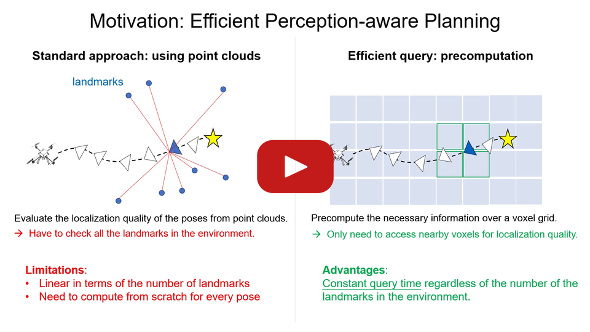

# Fisher Information Field: an Efficient and Differentiable Map for Perception-aware Planning

[](https://youtu.be/auQCljSmDKI)

> :pushpin: For an earlier version of this work that was published at ICRA 19, please checkout the `icra19` branch.

> :loudspeaker: The simulation environment (using NVIDIA Isaac) and evaluation pipeline (using COLMAP) will be added in Sep. 2020.

This repository contains an implementation of the **Fisher Information Field** (FIF for short), a map representation designed for perception-aware planning.
The core function of the map is to evaluate the visual localization quality at a given 6 DoF pose in a known environment (consisting of 3D landmarks to localize against).
It can be used with different motion planning algorithms (e.g., RRT-star, trajectory optimization) to take localization quality into consideration, in addition to common planning objectives (collision free, low dynamic cost, start and end states etc).
The main advantage of FIF is its efficiency at the planning time: it is 1~2 order-of-magnitude faster than using the landmarks directly in our experiments. In addition, FIF is also differentiable, making it suitable to be used in gradient-based optimization.

<details><summary>A quick illustration of using FIF in trajectory optimization</summary>
<p>

* 4 DoF piecewise polynomial trajectory for quadrotors. 10 seconds duration, 5 segments.
* Optimization slowed down for visualization.


For illustration purpose, the trajectory optimization is done in two steps with the following costs: 1) collision + dynamic; 2) collision + dynamic + localization quality.
The optimized trajectory of the first step is shown in red, and the second step in green.
The yellow points are the landmarks for localization, and the colored overlay is ESDF built with [voxblox](https://github.com/ethz-asl/voxblox).
The green trajectory, which in addition considers the localization quality, prefers to look at landmark-rich regions and move close to landmarks.

</p>
</details>

Please read the [preprint](http://rpg.ifi.uzh.ch/docs/Arxiv20_Zhang_FIF.pdf) and watch the [video](https://youtu.be/auQCljSmDKI) for details.
If you use this code in academic context, please cite the following papers:
* [Zichao Zhang](http://www.ifi.uzh.ch/en/rpg/people/zichao.html), [Davide Scaramuzza](http://rpg.ifi.uzh.ch/people_scaramuzza.html). **Fisher Information Field: an Efficient and Differentiable Map for Perception-aware Planning**. arXiv preprint, 2020.
[PDF](http://rpg.ifi.uzh.ch/docs/Arxiv20_Zhang_FIF.pdf)
[Video](https://youtu.be/auQCljSmDKI)
[Bibtex](doc/zhang20arxiv_fif.bib)
* [Zichao Zhang](http://www.ifi.uzh.ch/en/rpg/people/zichao.html), [Davide Scaramuzza](http://rpg.ifi.uzh.ch/people_scaramuzza.html). **Beyond Point Clouds: Fisher Information Field for Active Visual Localization**. ICRA, 2019.
[PDF](http://rpg.ifi.uzh.ch/docs/ICRA19_Zhang.pdf)
[Video](https://youtu.be/q3YqIyaFUVE)
[Bibtex](doc/zhang19icra.bib)

1. [Credit](#credit)
2. [Packages](#packages)
3. [Install](#install)
4. [Get Started](#get-started)

## Credit
The implementation of the information field uses the [voxel hashing](http://niessnerlab.org/papers/2013/4hashing/niessner2013hashing.pdf) algorithm implemented in [Voxblox](https://arxiv.org/abs/1611.03631).
The code we extracted from [Voxblox repository](https://github.com/ethz-asl/voxblox) is put in separate folders (`voxblox` and `voxblox_ros`), and the license is retained in `third_party/LICENSE_voxblox`. If you use the code specific to `Voxblox`, please see their repository and cite relevant publications accordingly.

The `unreal_cv` package uses some code from [ESIM](https://github.com/uzh-rpg/rpg_esim) and [UnrealCV](https://unrealcv.org/) for the interaction with UnrealEngine. If you use this part of the code, please check their repositories and refer to relevant publications accordingly.

## Packages
The FIF and the integration with ROS and motion planning algorithms are implemented as the following ROS packages:
* `act_map`: the core functionality of the FIF, independent of ROS
* `act_map_ros`: ROS wrappers, including parameter loading, essential publishing and subscribing topics and launch file examples.
* `act_map_msg`: simple ROS messages
* `act_map_exp`: example integration of FIF with different motion planning algorithms

In addition, there are several third-party packages in `third_party` folder for convenience. Please see the [README](third_party/README.md) there for details.
We also provide a ROS package `unrealcv_bridge` to interact with UnrealEngine for photorealistic rendering.

## Install
The code is tested on Ubuntu 18.04 with ROS Melodic. It should be possible to use in other ROS/Ubuntu versions.

### Install dependencies

First install ROS according to the [official instruction](http://wiki.ros.org/melodic/Installation/Ubuntu).
Then install some system dependencies:
```sh
sudo apt install python-pip python-catkin-tools python-vcstool libgoogle-glog-dev libatlas-base-dev libeigen3-dev  libsuitesparse-dev
pip install pyquanternion plotly GPy tqdm jupyter
```

Install `Ceres` from source if you have not yet according to [the official instruction](http://ceres-solver.org/installation.html#linux) (you can directly start from the point of extracting the source code).


Install `OMPL` from source if you have not yet according to the [official instruction](https://ompl.kavrakilab.org/installation.html).

`latex` is required for some plotting scripts but not the functionalities of the code.

### Clone and Compile
In where you would like to put the workspace, execute the following
```sh
mkdir FIF_ws && cd FIF_ws
catkin config --init --mkdirs --extend /opt/ros/melodic   --cmake-args -DCMAKE_BUILD_TYPE=Release
cd src
git clone git@github.com:uzh-rpg/rpg_information_field.git
vcs-import < ./rpg_information_field/dependencies.yaml
touch minkindr/minkindr_python/CATKIN_IGNORE
cd ..
catkin build 
```

## Get Started

**For the core function of the FIF**, please check the [documentation](act_map/README.md) in the `act_map` package, including:
* An overview of the implementation as well as detailed description of some core concepts.
* How to extend the FIF to include new functionalities
* Runnable code for the simulation experiments in the paper

**For the integration of FIF with motion planning algorithms**, please check the [documentation](act_map_exp/README.md) in the `act_map_exp` package, including
* Complete examples of using FIF in RRT* and trajectory optimization along with common planning objectives.
* Runnable code for the motion planning experiments in the paper
* (**TO BE RELEASED**) Quantitative evaluation of the localization accuracy in photorealistic simulation.