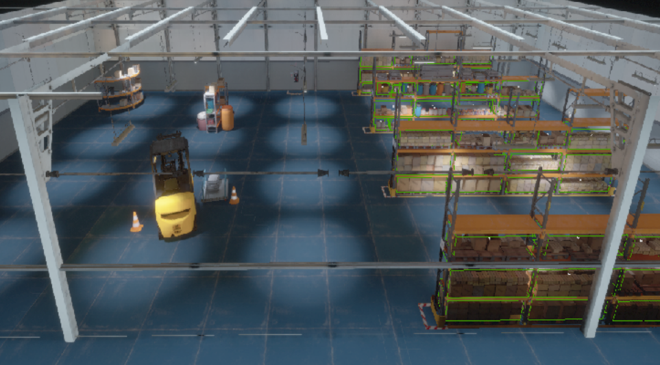

- [Package Overview](#package-overview)
- [A Quick Example](#a-quick-example)
  - [Step 1. Start the nodes](#step-1-start-the-nodes)
  - [Step 2. Load the maps](#step-2-load-the-maps)
  - [Step 3. Run the Planner](#step-3-run-the-planner)
- [Implement Your Own Planner: the `PlannerBase` class](#implement-your-own-planner-the-plannerbase-class)
- [Experiments in More Detail](#experiments-in-more-detail)
  - [Create Necessary Maps](#create-necessary-maps)
    - [Map Generation from UnrealEngine](#map-generation-from-unrealengine)
    - [Creating the Information Field](#creating-the-information-field)
  - [Run a Single Experiment](#run-a-single-experiment)
  - [Quantitative Evaluation of the Localization Accuracy](#quantitative-evaluation-of-the-localization-accuracy)
  - [Run Many Experiments for Comparison](#run-many-experiments-for-comparison)

# Package Overview

This package provides two planners (RRT* and quadrotor trajectory optimization) that uses the FIF along with other planning objectives. The RRT* uses the interface for [ompl](https://ompl.kavrakilab.org/), and the trajectory optimizations uses [this open-source implementation](https://github.com/ethz-asl/mav_trajectory_generation).

The main content of this package are:
* `src` and `include`: implementation of the planners
* `exp_data`: essential data for planning experiment
  *  different information about the environment (FIF, ESDF, depth map, landmarks and view directions) 
  *  the camera model used in the experiment
* `params`: parameters for the planning experiments
* `tests`: unit tests
* `scripts`: scripts for analyzing/plotting results or run experiments


The experiments are performed in the following warehouse environment, simulated using NVIDIA Isaac simulator:


**Download the Pre-built Maps** We provide pre-built maps in the environment that are sufficient for running the experiments. Please go to the `exp_data` and run:

```
./download.sh
```
This will download 

* ESDF, FIF and [DepthMap](../act_map/advanced.md) for planning
* COLMAP SfM models for [evaluating](#quantitative-evaluation-of-the-localization-accuracy) the localization accuracy on the planned motion

You can also [build your own maps](#map-generation-from-unrealengine) (for customized or your own environment)

**Simulator for Evaluation** The pre-built maps are sufficient to run the motion planning experiments, but to evaluate the localization accuracy of the poses from a planned trajectory/path, we need to run the photorealistic simulator (download [here](http://rpg.ifi.uzh.ch/datasets/FIF/warehouse_bin.zip) and run `./IsaacSimProject.sh -WINDOWED`). Also see `unrealcv_bridge` [documentation](../unrealcv_bridge/README.md) for more details.

**The Planning Experiments** Both the RRT* and trajectory optimization experiment follow a similar workflow. We first use trajectory optimization as a quick example and describe running other experiments in details later.


# A Quick Example

> Remember to source the workspace first before running the experiments.

## Step 1. Start the nodes

Start `roscore` and RVIZ, and select the config `./rviz_cfgs/quad_opt_warehouse.rviz`.

Start the planner:
```sh
# Note that here we initialize the map using GPInfoVoxel.
# We need to be consistent when loading the FIF layers at a later step.
roslaunch act_map_exp quad_traj_opt_warehouse_gp.launch node_name:=quad_traj_opt kernel_type:=GPInfo
```
and wait till the terminal prompts "Initialization Done" to proceed.

Start Voxblox:
```sh
roslaunch act_map_ros voxblox_warehouse.launch
```


## Step 2. Load the maps
Load ESDF to the voxblox node:
```sh
rosservice call /voxblox_node/load_map "file_path: '<absolute path to exp_data>/warehouse_voxblox/tsdf_esdf_max10.vxblx'"
# visualize mesh
rosservice call /voxblox_node/generate_mesh
```
Ask the voxblox node publish ESDF and TSDF
```sh
# in scripts folder
./ask_for_esdf.sh
```

Load the layers for FIF
```sh
# be sure to be consistent with the map type specified at the first step
rosservice call /quad_traj_opt/load_act_map_layers "file_path: '<absolute path to exp_data>/warehouse_FIF/gp_info_r2_a20'"
```

At this point, all the necessary information is loaded in the `quad_traj_opt` node. We can running the planning step (described below) multiple times without redoing the above steps.


## Step 3. Run the Planner
The planner state is specified in a yaml file, here `params/quad_traj_opt/warehouse/warehouse_traj_opt_trial.yaml`. The only thing that needs to be changed is the `save_traj_abs_dir` in the file, which needs to be point to an existing folder on your machine.
This will be the folder where the planning results (time, intermediate results in optimization, sampled poses) will be saved. You can create a folder under `trace`

```sh
# under act_map_exp/trace
mkdir  -p quad_traj_opt/warehouse_trial
```
and change `save_traj_abs_dir` to `<abs path to act_map_exp>/trace/quad_traj_opt/warehouse_trial`.

Running the planning experiment is simple. First set the state for the planner
```sh
rosservice call /quad_traj_opt/set_planner_state "config: '<absolute path to params>/quad_traj_opt/warehouse/warehouse_traj_opt_trial.yaml'"
```
and then execute the planner
```sh
rosservice call /quad_traj_opt/plan_vis_save
```
Then you should be able to see the visualization in RVIZ. After the planner finishes, call the following service to play the planned motion
```sh
rosservice call /quad_traj_opt/play_planned_traj
```

Now you can change the parameters in the `warehouse_traj_opt_trial.yaml` and run the planning again to see the difference.


# Implement Your Own Planner: the `PlannerBase` class
We provide a `PlannerBase` class (in `planner_base.h/cpp`) for specific planners to derive from and to still have a similar workflow.
The `PlannerBase` class contains both `ESDFServer` (from Voxblox) and `ActMapServer`, which provides essential information for planning.
The basic idea is that, a planning node will create a `PlannerBase` (or its child) instance and get the necessary information for the two servers (via topic or loading service, as shown above).
Planning is then done by using the information from the servers.

The base class, since it contains the two map servers, has all the services provided by the server class. In addition, the following services are added for convenience:

* `update_all_vis`: update all the visualization for different maps
* `clear_all_maps`: remove the contents of all the maps

A specific planner should inherit this class and implement the planning algorithm to test.
The base planner also provides services for controlling planning experiments (`set_planner_state` and `plan_vis_save`).
Please see `quad_rrt.h` and `quad_traj_opt.h` for examples.

# Experiments in More Detail

Next we describe the experiments in details, including how to generate maps for planning from the simulator, explanation of different motion planning experiments we can run, evaluation and how to run many experiments for comparison conveniently.

## Create Necessary Maps
> Pre-built maps are provided under `exp_data`. You can skip this section if you only want to use the pre-built maps.

Good maps are pre-requisite for the experiments. For the motion planning experiments, we need **1)** ESDF for collision check, **2)** SfM model for localization, **3)** FIF for considering localization accuracy and **4)** Densely sampled depth map for check occlusion.

### Map Generation from UnrealEngine

We can get photorealistic images and depth maps from UnrealEngine (UE) and build realistic maps for planning. Specifically, the following maps are created:

* A ESDF + TSDF map for collision-free motion planning 
  * **Workflow**: poses --> UE--> rendered depth maps --> Voxblox --> ESDF/TSDF
* A SfM model for better determining visible landmarks and localizing rendered images for evaluation
  * **Workflow**: poses --> UE --> rendered images --> COLMAP --> SfM model
* Densely sampled depth map for better visibility check.
  * **Workflow**: see `act_map/exp/exp_build_depth_map.cpp`.

See [the instructions to work with simulator](./mapping_with_UE.md) for details.

### Creating the Information Field
From the SfM model and the depth map, we can create the FIF. **First** launch the map server
```
roslaunch act_map_exp <launch_file> map_suf:=<map_suf>
```
where:
* `<launch_file>` is located under `launch/warehouse_servers`
  * The launch file loads necessary information from `exp_data/warehouse_depth_and_landmarks`
* `<map_suf>` corresponds to the map under `exp_data/warehouse_depth_and_landmarks`. See `README` there for details.

**Then** call the service to compute and save the map

```sh
rosservice call /act_map/recompute_kernel_layer
rosservice call /act_map/save_act_map_layers "file_path: '<abs_path>'"
```
where `<abs_path>` is the folder the layers will be written to.
We also provide a script `scripts/build_information_field_batch.py` to conveniently build different types of FIFs in one command.


## Run a Single Experiment
Once we have all the maps, running an experiment (RRT* or trajectory optimization) follows a similar procedure as the example above. Please read [the dedicated instructions](./run_a_single_exp.md) for details.

## Quantitative Evaluation of the Localization Accuracy 

After a trajectory/path is planned in a known environment, it is of interest to evaluate the localization accuracy of the poses from the planned motion (such as in Section VII-B of the [paper](http://rpg.ifi.uzh.ch/docs/Arxiv20_Zhang_FIF.pdf)). To do this, one needs to be able to render the images from these poses and localize the rendered images against known landmarks. We (again) utilize [NVIDIA Isaac simulator](https://developer.nvidia.com/isaac-sim) and [COLMAP](https://colmap.github.io/) for photorealistic rendering and visual localization respectively.

Once you have the simulator running (as mentioned at the beginning of this insturction), please see [the instructions for quantitatively evaluting the localization accuracy](./evaluation_localization_accuracy.md) for details.

## Run Many Experiments for Comparison
As in our paper, it is often needed to run many planning settings for comparison. We provide convenient setups for this.
Please see [batch_experiments.md](./batch_experiments.md) for details.