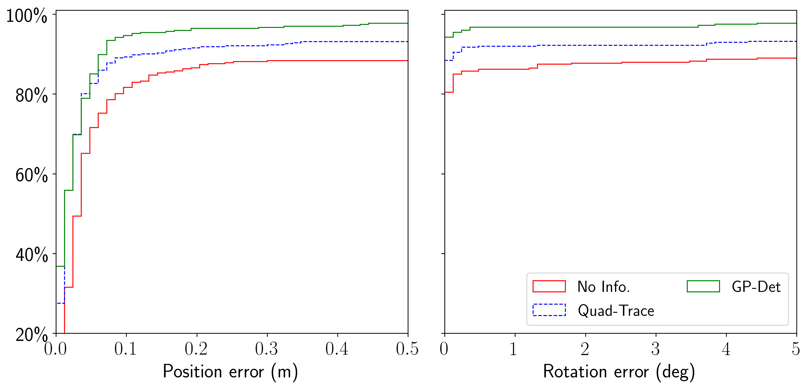

- [Pre-requisite](#pre-requisite)
- [Workflow](#workflow)
  - [Step 1: Start the Planners of different configurations](#step-1-start-the-planners-of-different-configurations)
  - [Step 2: Get Voxblox Layers](#step-2-get-voxblox-layers)
  - [Step 3 Get FIF Layers](#step-3-get-fif-layers)
  - [Step 4: Run All the Planners](#step-4-run-all-the-planners)
  - [Step 5: Analyzing the Results](#step-5-analyzing-the-results)

# Pre-requisite
We assume that all the maps required for planning are ready under `exp_data`. You can either download the pre-built maps or create them by yourself (see [README](./README.md)).

It is recommended to go through the [instructions](./run_a_single_exp.md) to run a single experiment first to get familiar with the process. These instructions aim to automate the same process for multiple motion planning experiments with different FIF voxels to compare their performance.

For evaluation, please make sure you have started the simulator as mentioned in the [main README](../README.md).

# Workflow

## Step 1: Start the Planners of different configurations
There are four `launch_*.sh` under `scripts/rrt` and `scripts/traj_opt` for creating typical planner nodes with unique names. Start them in four different terminals, e.g, for the trajectory optimization:

> :pushpin: Running many planners in parallel requires a significant amount of memory (since there are many copies of the maps). We ran our experiments on a workstation with 32 GB memory. You can reduce the number of experiments as needed.

```sh
# in act_map_exp
# terminal 1
./scripts/traj_opt/launch_quad_opt_gp_info_warehouse.sh
# terminal 2
./scripts/traj_opt/launch_quad_opt_gp_trace_warehouse.sh
# terminal 3
./scripts/traj_opt/launch_quad_opt_quadratic_info_warehouse.sh
# terminal 4
./scripts/traj_opt/launch_quad_opt_quadratic_info_warehouse.sh
```

## Step 2: Get Voxblox Layers
***First*** launch a voxlblox node
```
roslaunch act_map_ros voxblox_warehouse.launch
```
***Then*** load the layers (built from previous steps)
```
rosservice call /voxblox_node/load_map "file_path: '<abs_path_to_vxblx_file>'"
```
***Last*** publish the layers to all the planners
```bash
# in act_map_exp/scripts
./ask_for_esdf.sh
```
You should see corresponding output in the terminals where the planners are launched.

## Step 3: Get FIF Layers
There are scripts under `scripts/rrt` and `scripts/traj_opt` to load the FIF layers into all the planners for convenience. For example, for the trajectory optimization experiment, run 
```bash
# in scripts/traj_opt
./load_maps_warehouse_r2_a20.sh
```
to load the maps built before for the landmarks `r2_a20` into all the planners. Again, you should see corresponding output in the terminals where the planners are launched.

> :heavy_exclamation_mark: If you only start part of the FIF servers mentioned above, you need adapt the script of loading different maps (commenting out unneccessary commands).


## Step 4: Run All the Planners

`scripts/run_planner_exp.py` provides an interface to run different configurations (map representations, information metrics) conveniently. 
It accepts a configuration file that specifies
* `M` base planning objectives (start, end, different costs and their weights)
* `N` variations (planner node to call, information metric to use, whether to compute the information from point clouds)

Then, it runs `M * N` experiments and the evaluation in sequence and saves the results in the specified output directory. Example configuration files can be found in:

* `params/quad_rrt/warehouse/warehouse_all.yaml` for the RRT experiments
* `params/quad_traj_opt/warehouse/warehouse_all.yaml` for the trajectory optimization experiments

> :fast_forward: For trajectory optimization, we provide a configuration file `params/quad_traj_opt/warehouse/warehouse_all_subset.yaml` that contains a subset of the variations (i.e., taking less time to run). You can use this configuration if you just want to have a quick walk through of the experiment process.

Therefore you could run all the experiments in one command like:

```sh
./scripts/run_planner_exp.py <config_file> --top_outdir <outdir> --colmap_script_dir <colmap_scripts> --base_model <colmap_base_model> --unrealcv_ini <unrealcv_config_file>
```
> :heavy_exclamation_mark: The `<colmap_base_model>` loaded here needs to be consistent with the FIF loading scripts executed above (i.e., `r1_a30` or `r2_a20` in this case).

We also pass in `<colmap_scripts>` (pointing to where you clone [our scripts](https://github.com/uzh-rpg/colmap_utils)) and `<colmap_base_model>` to let the script automatically render images from the sampled poses of the planned motion, localize against `<colmap_base_model>` and calculate the localization errors. `--unrealcv_ini` should point to the [UnrealCV configuration file](../unrealcv_bridge/README.md) to determine the correct camera intrinsics.

It will take some time if you run everything, especially for RRT*. After everything is finished, you will have some folder structure like this under `<outdir>`:

```txt
<outdir>
├── warehouse_left   --> one of the M planning objectives
│   ├── analysis_cfg.yaml  
│   ├── warehouse_left_gp_det --> one of the N variations
│   ├── warehouse_left_none
│   └── warehouse_left_quad_trace
.......
├── warehouse_mid
│   ├── analysis_cfg.yaml
│   ├── warehouse_mid_gp_det
│   ├── warehouse_mid_none
│   └── warehouse_mid_quad_trace
......
```

where each sub-folder stores the corresponding experiment results.

## Step 5: Analyzing the Results

The following scripts are provided to analyze the experimental results:
* `scripts/analyze_traj_opt.py`: trajectory optimization specific analysis
* `scripts/analyze_rrt.py`: RRT* specific analysis
* `scripts/analyze_pose_errors.py`: analyze pose errors, applicable to both trajectory optimization and RRT*

> :heavy_exclamation_mark: Note that **for both trajectory optimization and RRT***, all the analysis scripts use a yaml analysis configuration file (examples under `params/quad_rrt` or `params/quad_traj_opt`)  to know which folder to find and how to plot for different variations. The default yaml files (`base_analysis_cfg.yaml`) are compatible with the experiment configurations provided (`warehouse_all.yaml`), but you will need to customize the analysis configuration files once you customize the experiments.
>
> :fast_forward: For the subset configuration mentioned above (`params/quad_traj_opt/warehouse/warehouse_all_subset.yaml`), the corresponding analysis configuration is `params/quad_traj_opt/base_analysis_cfg_subset.yaml`.

### Trajectory optimization

Run

```sh
# in act_map_exp
rosrun act_map_exp analyze_traj_opt.py <outdir> --base_ana_cfg <analysis_cfg_yaml> --multiple
```

where

* `<output_dir>`  is the top output directory specified in Step 4
* `<analysis_cfg_yaml>`: should points to a yaml file specifying plot settings for different FIF voxels, as well as some analysis to be done. See the example `params/quad_traj_opt/base_analysis_cfg.yaml` for details.
* `--multiple` indicates the `<outdir>` will contain several planning objectives as mentioned above.

After running this, several plots and text files (e.g., tables for the running time) will be generated under `<outdir>`.

### RRT*

Analyzing RRT* results uses a similar command:

```sh
rosrun act_map_exp analyze_rrt.py <outdir> --base_ana_cfg <analysis_cfg_yaml> --multiple
```

where

* `<analysis_cfg_yaml>`: you can find an example `params/quad_rrt/base_analysis_cfg.yaml`

The results will be saved in `<outdir>`.

### Plot Pose Errors

This works for both trajectory optimization and RRT*, since it will look for the `pose_errors.txt` in each result folder (see [how the evaluation works](./evaluation_localization_accuracy.md)).

Simply run

```sh
# in act_map_exp
rosrun act_map_exp analyze_pose_errors.py  <outdir> --base_ana_cfg <analysis_cfg_yaml>  --multiple --plt_min_ratio 0.2 --plt_max_ratio 1.0
```

and this command will generate the accumulative histogram of the pose errors for different variations. It will read the `ordered_types` in the yaml configuration, so make sure it corresponds to the actual experimental results under `<outdir>`. For example, with the experiment configuration `params/quad_traj_opt/warehouse/warehouse_all_subset.yaml` and the analysis configuration `params/quad_traj_opt/base_analysis_cfg_subset.yaml`, you will have a plot that looks like




