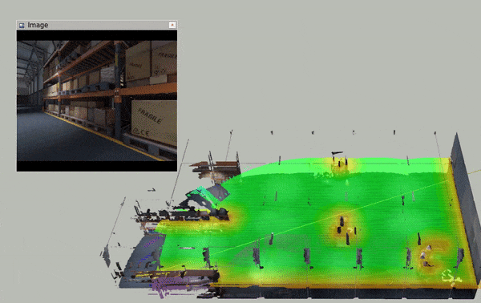

# Mapping with UnrealEngine

Here we describe how we can get different information from the UnrealEngine (NVIDIA Isaac in our case) for motion planning. **The instructions basically describes how the provided maps are built.** It should be easy to adapt it to other environment (UnrealCV integrated UnrealEngine game/simulation). Note that the interaction with UnrealEngine simulator is done via the code in `unrealcv_bridge`.

- [Mapping with UnrealEngine](#mapping-with-unrealengine)
  - [Create an ESDF for collision avoidance](#create-an-esdf-for-collision-avoidance)
  - [Create a SfM model for localization](#create-a-sfm-model-for-localization)
  - [Create a `DepthMap` to help visibility check](#create-a-depthmap-to-help-visibility-check)

## Create an ESDF for collision avoidance

First, start the simulation environment

```sh
./IsaacSimProject.sh -WINDOWED
```

We then use the code from `act_map_ros` to scan the environment and build ESDF. Below is a summary of the workflow, and for details please read the documentation in `act_map_ros`.

Launch RVIZ and use the configuration file `act_map_ros/cfgs/warehouse.rviz` to visualize.

Launch the Voxblox node:

```sh
roslaunch act_map_ros voxblox_warehouse.launch
```

Launch the virtual sensor using UnrealCV:

```sh
roslaunch act_map_ros ue_provider_node.launch auto_scan:=true
```

Then you will see something like this (after some scanning):



Per default, the voxblox node will not publish the built ESDF and mesh shown above,, for which you can do it manually

```sh
rosservice call /voxblox_node/publish_pointclouds
rosservice call /voxblox_node/generate_mesh
```

Finally, when the scanning is done, you can save the map:

```sh
rosservice call /voxblox_node/save_map "file_path: '<abs_path_to_save>/tsdf.vxblx'"
```

> Alternatively, you can also use `auto_scan:=false` and manually control the camera in the simulator to follow whatever path you prefer.

## Create a SfM model for localization

> For this part, you need to be able to use our [COLMAP scripts](https://github.com/uzh-rpg/colmap_utils). See the instructions there for necessary setups.

First, start the simulation environment

```sh
./IsaacSimProject.sh -WINDOWED
```

We then use the code from `unrealcv_bridge` to  render images and code in [colmap_utils](https://github.com/uzh-rpg/colmap_utils) to build the SfM model. Please read the related documentations for details. We summarize the necessary steps below.

First, record a camera trajectory to render images from. Run the pose recorder:

```sh
rosrun unrealcv_bridge record_pose_ue.py --out_dir ./ --Hz 10 --timeout 30
```

You can download the trajectory that we used [here](http://rpg.ifi.uzh.ch/datasets/FIF/warehouse_sfm_xyzpyr_ue.txt). Then in the folder with the pose file

```sh
rosrun unrealcv_bridge render_from_poses.py ./warehouse_ue_xyzpyr_ue.txt --unreal_ini <unrealcv_ini> --save_dir ./warehouse_r2_a20
```

where `<unrealcv_ini>` points to the configuration file of your simulator (to get the correct camera intrinsics) and `warehouse_ue_xyzpyr_ue.txt` is the recorded/downloaded pose file.

At this point, you should have a folder structure like

```
warehouse_r2_a20
├── images
├── img_name_to_colmap_Tcw.txt
├── img_nm_to_colmap_cam.txt
└── ue_xyzpyr.txt
```

Finally, run COLMAP reconstruction in `warehouse_r2_a20`:

```sh
python3 <colmap_utils_dir>/reconstruct_from_known_poses.py ./ --img_to_colmap_cam_list ./img_nm_to_colmap_cam.txt --img_to_colmap_pose_list ./img_name_to_colmap_Tcw.txt  --overwrite_db --tri_filter_max_reproj 2.0 --tri_filter_min_angle 20.0
```

and this will give the SfM model used in our experiment. You can also change `--tri_filter_max_reproj` to `1.0` and `--tri_filter_min_angle` to `30.0` to only keep more accurate landmarks.

## Create a `DepthMap` to help visibility check

First, change the simulator configuration file to something like (to keep it consistent with the hardcoded intrinsics in `exp/exp_build_depth_map.cpp`:

```ini
[UnrealCV.Core]
Port=9000
Width=640
Height=640     
FOV=90.000000
EnableInput=True 
EnableRightEye=False
```

> :exclamation: Remember to change it back after finishing building the depth map, since we can only use the configuration file to change the camera intrinsics.

Then create a folder `build_depth_map` under `act_map/trace`, and run:

```sh
rosrun act_map exp_build_depth_map  --config_fn dm_warehouse_test.txt  --step_deg 2
```

This will sample the depth from the environment according to the file `act_map/cfg/dm_warehouse_test.txt` and save it under `act_map/trace/build_depth_map`.  After building the map, you can visualize it following the instructions [here](../act_map_ros/virtual_sensor_and_depth_map.md).

Note that the default setting will take some time to build the depth map. You can increase the `vox_size` or reduce x/y/z ranges for a shorter scanning time.