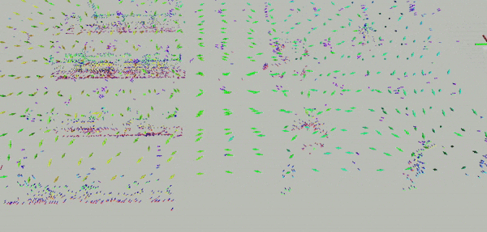

This package mainly implements the ROS wrappers for the `act_map` package, including publishing/subscribing topics, parameter reading and visualization.

In addition, there are some auxiliary code for experiments, including

* a virtual image + depth sensor using UnrealCV
* visualization of the `DepthMap` (implemented in `act_map/src/depth_map.cpp`)

Please see [the corresponding documentation](./virtual_sensor_and_depth_map.md) for more details about the virtual sensor setup.

## A Quick Example

First , launch RVIZ for visualization with the configuration file `cfg/warehouse.rviz`.

Then launch the provided FIF server:

```sh
roslaunch act_map_ros gp_trace_map_warehouse.launch map_suf:=r2_a20
```

It will load all necessary information required to build the FIF (depth map, landmarks, and view directions) from `act_map_exp/data`.  You can visualize the loaded information using

```sh
rosservice call /act_map/update_act_map_viz
```

Then you can compute the FIF using

```sh
rosservice call /act_map/recompute_kernel_layer
```

And the final visualization will be something like



## The `ActMapServer` Class

`ActMapServer` is a templated class that provides an interface for the information field. The most important functions are:

* build information field incrementally (as 3D features are added) or in a batch
* publish and receive the information field (as Voxblox layers) via ROS messages
* load and save the information field
* query the information at a given pose (e.g., used in planning, see `act_map_exp`)

Under the `src` folder, there are several specializations of the server class using different voxel types (i.e., the  `*_server_node.cpp` files).

## Incremental Update

> TODO: add an example and test data


