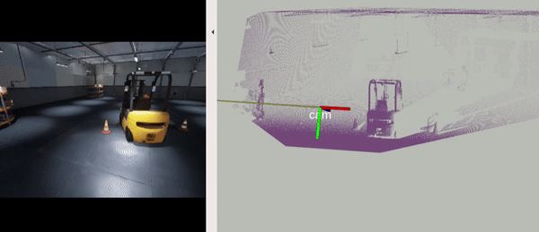

## Virtual Sensor Using UnrealCV

### Run the sensor

>:exclamation: Since we can only change the camera intrinsics via the configuration file for the simulation, make sure that you have the same camera intrinsics in `ue_provider_node.launch` and the configuration file of the simulation  ` (LinuxNoEditor/IsaacSimProject/Binaries/Linux/unrealcv.ini`) before proceeding.

Start the simulation environment (see [the README](../README.md))

```sh
./IsaacSimProject.sh -WINDOWED
```

And then start the virtual sensor

```sh
roslaunch act_map_ros ue_provider_node.launch
```

You can then visualize the sensor output using RVIZ (with the configuration `cfgs/ue_provider.rviz`).  If you manually control the camera movement in the simulator, you will observe something like this:



where on the left is the rendered images, and right the simulated depth sensor output.

### Build a map

Using the above output, we can build a map via `voxblox`. Launch the voxblox node by

```sh
roslaunch act_map_ros voxblox_warehouse.launch
```

And you can continue to move the camera around the warehouse environment a bit, and then check the map built by `voxblox` via

```sh
rosservice call /voxblox/generate_mesh
rosservice call /voxblox/publish_pointclouds
```

You will see something like this:


### Automatic mode :robot:

The quality of the map highly depends on the exploration path of the camera. To build a complete map of the environment, it is ideal to densely sample the possible poses. For this , when launching `ue_provider.launch`, you can add `auto_scan:=true` to the command to make the node automatically sample a space (according to `auto_scan_range`) instead of having to manually control the camera. Then the map can be built in  the same way as before. This is how the ESDF provided in `act_map_exp/exp_data/warehouse_voxblox` was built.

### Implementation details

`UEProvider` is an interface that talks with an UnrealCV server. It basically simulates a sensor that corresponds to the camera in Unreal Engine and publishes the following:

* The pose of the sensor as `tf` transformation
* The image of the sensor
* The depth (z-depth)

This can be used as the input to vision algorithms (e.g., mapping using a depth camera).

## Visualize the Depth Map

To visualize the depth map, you can run (it will read the depth map under `act_map_exp/exp_data/warehouse_depth_and_landmarks`)

```sh
roslaunch act_map_ros depth_map_vis.launch
```

At this moment, you will have to keep the `depth_layer*` parameters consistent with the ones that were used to [build the depth map](../act_map_exp/mapping_with_UE.md). Launch RVIZ with the configuration file `cfgs/depth_map.rviz`

Then in another terminal, start the visualization

```sh
rostopic pub -r 1 /depth_map_cmd std_msgs/String "v"
```

This command will "randomly" go through (at the rate of 1 Hz) all the voxels  in the depth map and visualize the depth map stored in each `DepthVoxel`. You will observe something similar to


The blue lines denote the visible landmarks from the voxel position. The rainbow colored points denote the sampled depth from the voxel, and the white points are the landmarks in the environment. Note that some of the white points (e.g., bottom right) are not visible due to the occlusion at a closer distance.